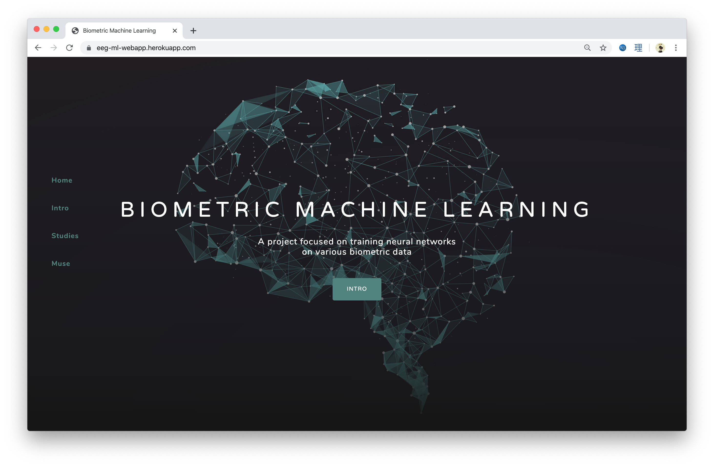
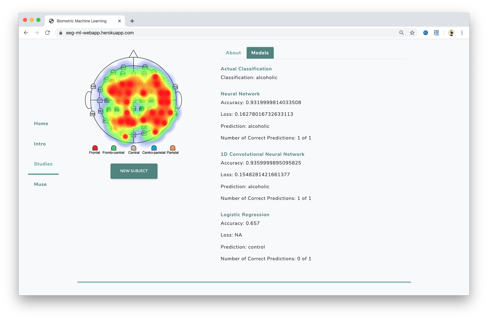
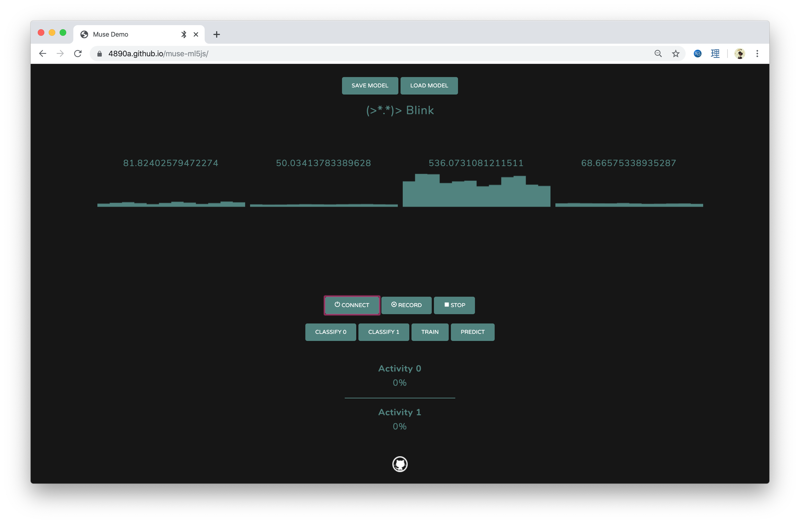
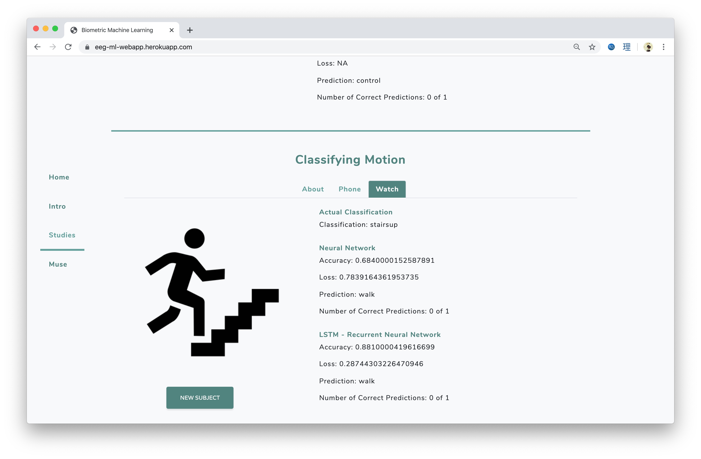

# An Interactive Exploration of Machine Learning in Biometrics

Explore various machine learning models and their relative performance.   We model the effects of alcoholism on brain waves, and the classification of physical behavior using smart devices.

Users with a muse headband can train their own classifier to identify the difference between two simple activities using only their brain waves. This demo uses client-side javascript (tensorflow.js) to train and predict a neural network.

## Screenshots

